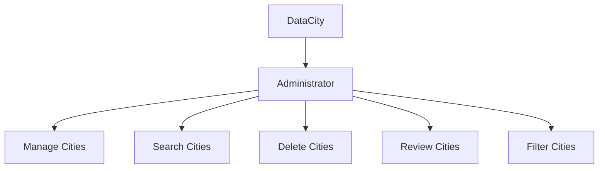

<h1 style="text-align: center;">DataCity 🌏</h1>

## Table of Contents
| Index | Title  |
|--|--|
| 1. | [Description](#Description) |
| 2. | [Features](#Features) |
| 3. | [Technologies Used](#Technologies) |
| 4. | [Repository Usage](#Usage) |
| 5. | [Execution Instructions](#Instructions) |
| 6. | [App Map](#Map) |
| 7. | [Authors](#Authors) |

## Description🚀

The DataCity project is a management platform consisting of a city search tool by name, postal code, population number, and the country it belongs to.

## Features🧮

1. **Create City** 👥: Allows registering and adding information about the city you want to create.

2. **Update City** 🌐: Allows updating city information.

3. **Search City** 🌐: Allows searching for cities.

## Technologies🖥️

- **Python** 🐍: The entire application is built with Python.

## Usage📝

This repository contains the source code for the DataCity project, organized by roles and functionalities within CityData. Each directory and file is structured to facilitate the development, maintenance, and deployment of the application.

## Instructions📐

### Prerequisites

- Python 3

### Steps

1. Clone the repository to your local machine.  
2. Properly configure all necessary Python settings.  
3. Run the project from the terminal.

## Map🗺️

## Authors👤

[Leonardo Gonzalez](https://github.com/DLeonardoG)

[Erik Sneyder](https://github.com/ErikSneyPlata)
