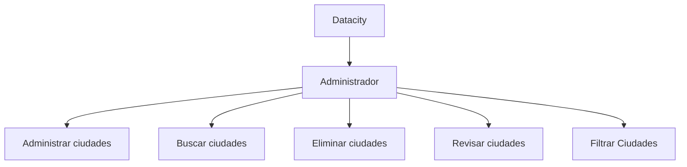

<h1 style="text-align: center;">DataCity 🌏</h1>

## Tabla de contenido
| Indice | Título  |
|--|--|
| 1. | [Descripción](#Descripcion) |
| 2. | [Características](#Características) |
| 3. | [Tecnologías Utilizadas](#Tecnologias) |
| 4. | [Uso del Repositorio](#Uso) |
| 5. | [Instrucciones de Ejecución](#Instrucciones) |
| 6. | [Mapa de la app](#Mapa) |
| 7. | [Autores](#Autores) |

## Descripcion🚀

El proyecto DataCity es una plataforma de gestión consiste en un buscador de ciudades por su nombre, codigo postal, numero de poblacion y pais al que pertenece.

## Características🧮

1. **Crear ciudad** 👥: Permite registrar y añadir informacion de la ciudad que se quiere crear

2. **Actualizar ciudad** 🌐: Permite actualizar informacion de la ciudad 

3. **Buscar ciudad** 🌐: Permite buscar ciudades

## Tecnologias🖥️

- **Python** 🐍: Todas la aplicacion esta hecha con python.

## Uso📝

Este repositorio contiene el código fuente del proyecto DataCity, organizado por roles y funcionalidades dentro de CityData. Cada directorio y archivo está estructurado para facilitar el desarrollo, mantenimiento y despliegue de la aplicación.

## Instrucciones📐

### Requisitos Previos

- Python 3

### Pasos

1. Clona el repositorio a tu máquina local. 
2. Configura adecuadamente todo lo adecuado respecto a python.
3. Ejecuta el proyecto desde la terminal.

## Mapa🗺️

## Autores👤

[Leonardo Gonzalez](https://github.com/DLeonardoG)

[Erik Sneyder](https://github.com/ErikSneyPlata)
